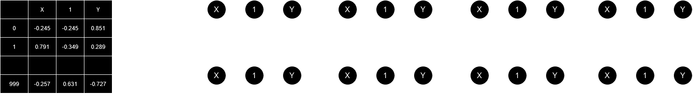
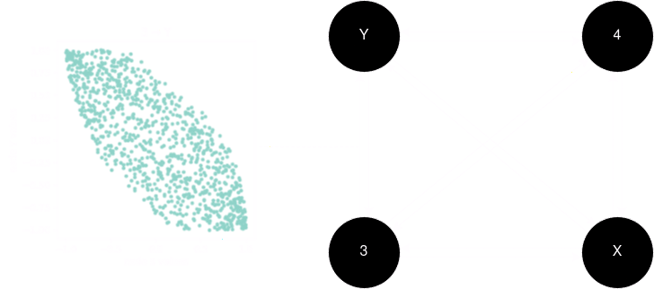
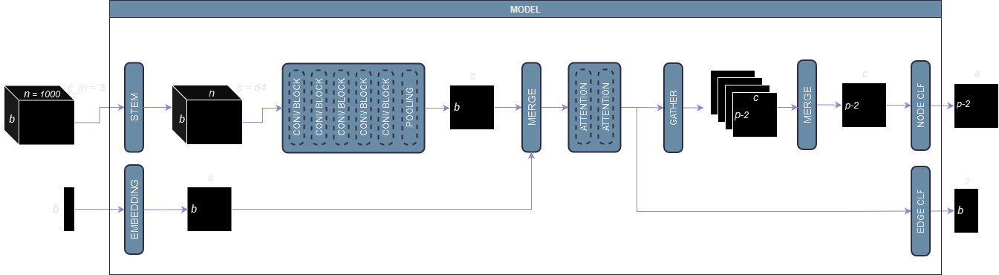
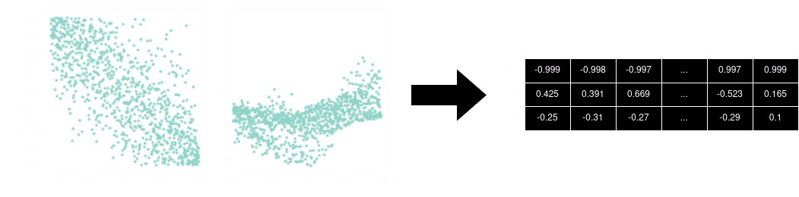
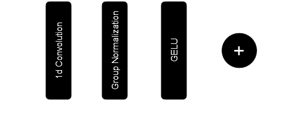
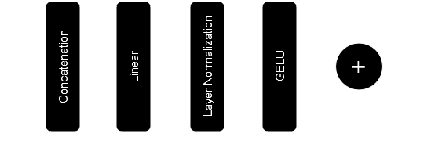
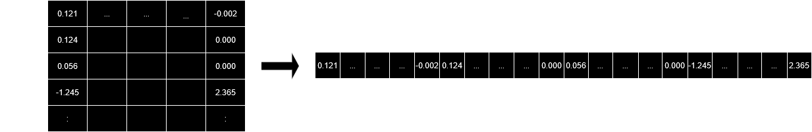

# ADIA LAB CAUSAL DISCOVERY CHALLENGE

In August 2024, Adia Lab and CrunchDAO launched a competition to help advance the field of Causal Discovery in AI. Participants were given a set of 23.500 observational data, each of which containing 1000 observations for a number of variables ranging from 3 to 10. There were 2 special variables, namely $X$ (the treatment) and $Y$ (the outcome). The goal of this competition was to classify each variable according to their relationship with $X$ and $Y$.

<figure style="text-align: center;">
  
  <figcaption>Fig. 1 Observational data and possible classes of node 1</figcaption>
</figure>

Submissions were ranked by computing the balanced accuracy (the average of recall obtained on each class). The solution presented below clinched the top spot achieving 76.7% on the private leaderboard.

## Solution Overview

In a nutshell, the solution can be seen as a Graph Neural Network where edge features are used to classify nodes. With GNNs, node classification is often performed by leveraging node data to generate node embeddings. Sometimes, edge data are also incorporated to improve overall performance. However, here, we exclusively rely on edge features to classify nodes.

We start with a fully connected bidirectional graph where each node represents a variable. A simple way to transform the observational data into edge data is by drawing scatter plots. It turned out that just giving the scatter plot data as inputs to the model was not enough. Some extra processing was needed (more details in the next section).

<figure style="text-align: center;">
  
  <figcaption>Fig. 2 A fully connected, bidirectional graph with data for edge 3 &#8594; Y</figcaption>
</figure>

The model receives edge data and performs the following steps:

1. a stem layer increases the number of channels to 64
2. edge features are extracted using a stack of 5 residual convolutional blocks
3. a pooling operation outputs a 64-dimensional embedding for each edge
4. a stack of 2 self-attention layers refines the edge embeddings

Finally, the edge embeddings are given to 2 classification heads:

- the first classification head retrieves the adjacency matrix (but is only used at training)
- for each node $u$ different from $X$ and $Y$, the second classification head merges embeddings from edges $u \rightarrow X$, $u \rightarrow Y$, $X \rightarrow u$ and $Y \rightarrow u$ in order to perform node classification

<figure style="text-align: center;">
  
  <figcaption>Fig. 3 An overview of the model where p is the number of nodes and b the number of edges</figcaption>
</figure>

## Data Preprocessing

In a task like Image Classification, strong results can be obtained by using models which only take the image values as inputs. For this challenge, the first attempt was to represent each edge $u \rightarrow v$ with raw values only: one channel holding the 1000 observations of node $u$ and the other channel holding the observations of node $v$. Observations would be sorted according to the values taken by $u$. Unfortunately, the model needed a bit of help... Consequently, an extra channel holding the coefficients of a multivariate kernel regression was added. The multivariate kernel regression finds a set of coefficients such that
$$u_{i, j} \approx c_{i, 0} + \sum_{k = 1, k \ne j}^{p} c_{i, k} u_{i, k}$$
where $p$ is the number of nodes and $u_{i, k}$ is the value of node $u_k$ taken at the $i$-th observation. The coeficients are found by computing the solution to a weighted local linear regression. The goal is to minimize:
$$\sum_{l=1}^{n} w(u_i, u_l) \left( u_{l, j} - c_{i, 0} - \sum_{k = 1, k \ne j}^{p} c_{i, k} u_{l, k} \right) ^2$$

where the weight function $w$ derives from a gaussian kernel.

<figure style="text-align: center;">
  
  <figcaption>Fig. 4 An example of data transformed for edge u &#8594; v</figcaption>
</figure>

Finally, each observational data with $p$ variables is transformed into a 3d tensor:

- the first dimension has size $p \times (p-1)$ (the number of directed edges)
- the second dimension has size 3 (the number of channels)
- the last dimension has size 1000 (the number of observations)

In addition to the previous tensor, the model also receives a tensor of size $p \times (p-1)$ which holds integers identifying the type of edge. The type of an edge $u \rightarrow v$ is one of the following:

- $u$ is $X$ but $v$ is not $Y$
- $u$ is $Y$ but $v$ is not $X$
- $u$ is not $Y$ but $v$ is $X$
- $u$ is not $X$ but $v$ is $Y$
- $u$ is $X$ and $v$ is $Y$
- $u$ is $Y$ and $v$ is $X$
- none of the above

## Model Blocks

The model takes one graph at a time. Please refer to figure 3 for a model overview.

### Stem Layer

The sole purpose of the stem layer is to increase the number of input channels (3) to the hidden dimension of the model (64). It is a simple linear transformation.

### Convolutional Block

Each convolutional block is a 1d convolution followed by Group Normalization and GELU activation, with residual connection.

<figure style="text-align: center;">
  
  <figcaption>Fig. 5 Convolution Block</figcaption>
</figure>

There is a stack of 5 convolutional blocks. After the convolutions, an average pooling is performed to generate a 64-dimensional embedding for each edge.

### Edge Type Embedding

Edge type embeddings are implemented as a simple lookup table.

### Merge Operator

The merge operator concatenates a list of inputs on their channel dimension. Then, it reduces the number of channels back to the model dimension (64). A Layer Normalization is applied, followed by GELU activation.

<figure style="text-align: center;">
  
  <figcaption>Fig. 6 Merge Block</figcaption>
</figure>

### Self-Attention Block

The self-attention block is a multi-head attention with residual connection.

### Edge Classification

This classification head retrieves the adjacency matrix but is only used at training. A linear layer reduces the edge embeddings to 2 channels.

### Node Classification

First, edge embeddings are merged to generate node embeddings (via the Merge operator). For node $u$, embeddings from edges $u \rightarrow X$, $u \rightarrow Y$, $X \rightarrow u$ and $Y \rightarrow u$ are gathered. A linear layer transforms the node embeddings into 8 channels (i.e. the number of classes).

<figure style="text-align: center;">
  
  <figcaption>Fig. 7 The gathering of edge embeddings for node 1.</figcaption>
</figure>

## About Training

During the training process, the learning rate is reduced following a cosine annealing schedule. The selected optimizer was AdamW. The final loss is the sum of 2 losses:

- the cross entropy loss computed on the binary edge classification task
- the cross entropy loss computed on the node classification task

In each case, the loss is weighted by the inverse frequency of each class.

## A few thoughts

The solution uses a multivariate kernel regression but no other regression technique was evaluated. We could go even further and wonder whether the regression could have been performed directly by the neural network in the very first layers (for a truly end-to-end solution). After all, minimizing the regression loss could be done by gradient descent.

The model is lightweigt (less than 0.3M parameters). During the development phase, inference was performed on a set of 9.000 observational data. The computation of the multivariate regression was parallelized and took about 17min30 (on a 32-core CPU). Inference on a single model then took about 1min30 on GPU (one graph at a time, sequentially).

Finally, I would like to thank everybody involved in the preparation of this challenge. It was my first experience with causal discovery and this was a great learning experience!
